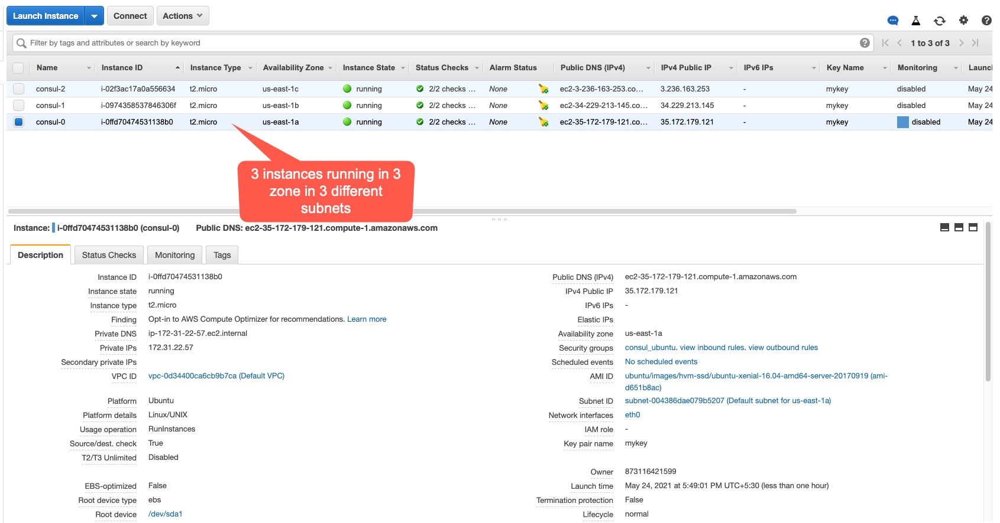
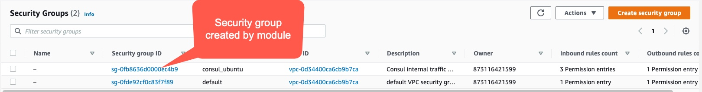
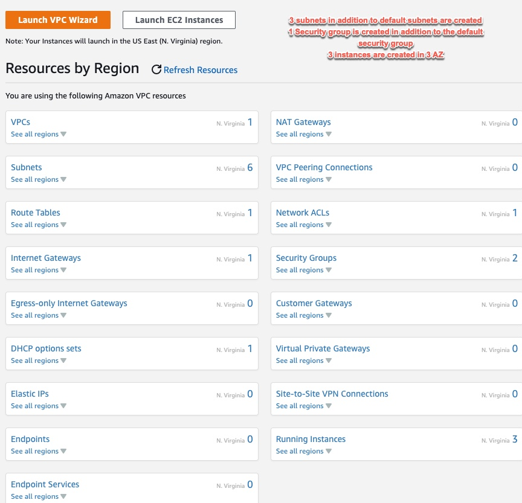
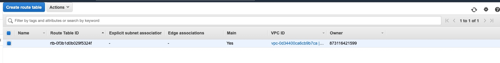

# Using module, create 3 subnets, 3 security groups, 1 route table , 3 EC2 intances in 3 availability zones

# This example uses the module consul to create the subnets, instance and security groups.

# Create a default VPC using the AWS console.

# Run the command 'terraform get' to download the module

# Run terraform init

# Run terraform plan

# Run terraform apply

# Run terraform destroy

# AWS CLI is configured to read the secret and access keys and hence these are not asked by Terraform.

