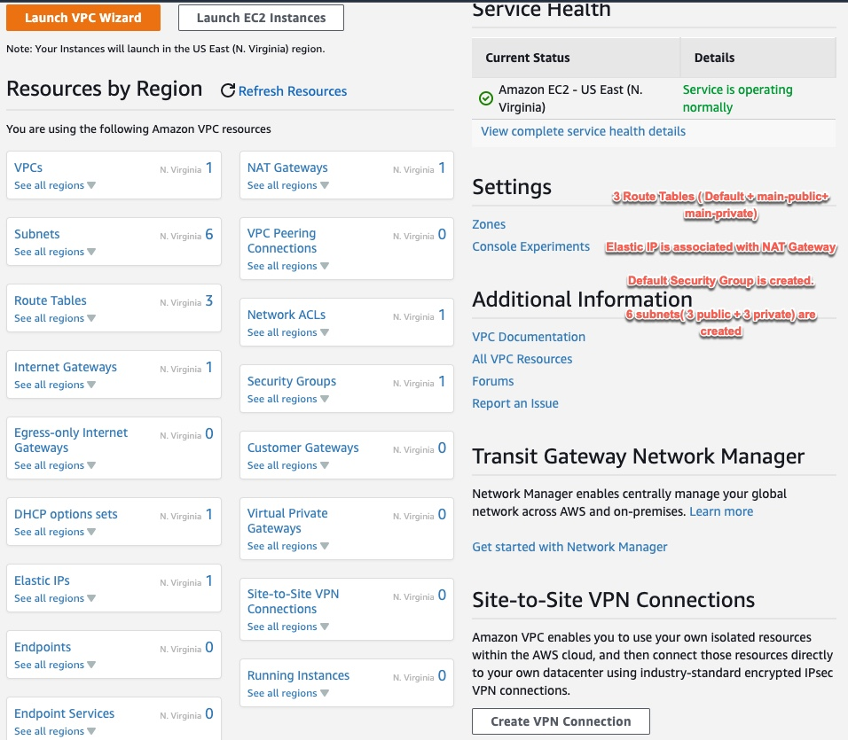
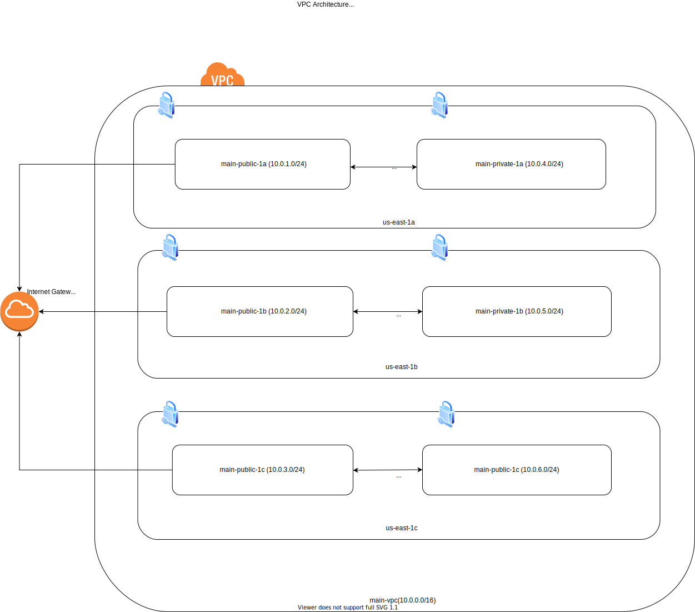

# VPC Architecture is below (N.Virginia/us-east-1)
# 1 VPC Per Region, with 6 subnets ( 3 public subnets + 3 private subnets )

# Private Subnets (AWS Defined CIDR block range,largest subnet range)

# VPC is 10.0.0.0/8 is largest CIDR block, which is possible
# VPC is 172.16.0.0/12 is largest CIDR block, which is possible
# VPC is 192.168.0.0/16 is largest CIDR block, which is possible

# In this demo/example we create a VPC with 3 public subnets and 3 private subnets, 1 default route table and nat gateway
# Default route table will connect public subnets to internet gateway
# nat gateway will connect the private subnets to internet gateway

| Range          	| From        	| To                 	|
|----------------	|-------------	|--------------------	|
| 10.0.0.0/8     	| 10.0.0.0    	| 10.255.255.255.255 	|
| 172.16.0.0/12  	| 172.16.0.0  	| 172.31.255.255     	|
| 192.168.0.0/16 	| 192.168.0.0 	| 192.168.255.255    	|

# Subnet masks and CIDR range
| Range          	| From        	| To                 	|
|----------------	|-------------	|--------------------	|
| 10.0.0.0/8     	| 10.0.0.0    	| 10.255.255.255.255 	|
| 172.16.0.0/12  	| 172.16.0.0  	| 172.31.255.255     	|
| 192.168.0.0/16 	| 192.168.0.0 	| 192.168.255.255    	|

# Guidelines for CIDR, Network mask, IP addresses with examples

| Range       	| Network mask    	| Total addresses 	| Description                                      	| Examples                         	|
|-------------	|-----------------	|-----------------	|--------------------------------------------------	|----------------------------------	|
| 10.0.0.0/8  	| 255.0.0.0       	| 16,777,214      	| Full 10.x.x.x range                              	| 10.0.0.1, 10.100.200.20          	|
| 10.0.0.0/16 	| 255.255.0.0     	| 65,536          	| What we used for our VPC                         	| 10.0.5.1, 10.0.20.2 , 10.0.100.3 	|
| 10.1.0.0/16 	| 255.255.0.0     	| 65,536          	| What we can use for another VPC                  	|  10.1.5.1, 10.1.20.2, 10.1.100.3 	|
| 10.0.0.0/24 	| 255.255.255.0   	| 256             	| All addresses within from  10.0.0.0-10.0.0.255   	| 10.0.0.1, 10.0.0.2, 10.0.0.3     	|
| 10.0.1.0/24 	| 255.255.255.0   	| 256             	| All addresses within from  10.0.1.0 - 10.0.1.255 	| 10.0.1.1, 10.0.1.2, 10.0.1.3     	|
| 10.0.0.5/32 	| 255.255.255.255 	| 1               	| Single host                                      	| 10.0.0.5                         	|

# AWS VPC Created by Terraform

# Logical Architecture

