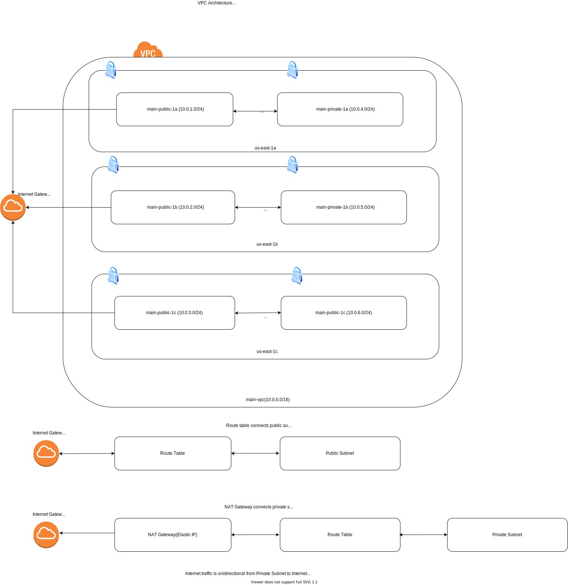

# VPC Architecture is below (N.Virginia/us-east-1)
# 1 VPC Per Region, with 6 subnets ( 3 public subnets + 3 private subnets )

# Private Subnets (AWS Defined CIDR block range,largest subnet range)

* VPC is 10.0.0.0/8 is largest CIDR block, which is possible
* 
* VPC is 172.16.0.0/12 is largest CIDR block, which is possible
* 
* VPC is 192.168.0.0/16 is largest CIDR block, which is possible
* 
| Range          	| From        	| To                 	|
|----------------	|-------------	|--------------------	|
| 10.0.0.0/8     	| 10.0.0.0    	| 10.255.255.255.255 	|
| 172.16.0.0/12  	| 172.16.0.0  	| 172.31.255.255     	|
| 192.168.0.0/16 	| 192.168.0.0 	| 192.168.255.255    	|

